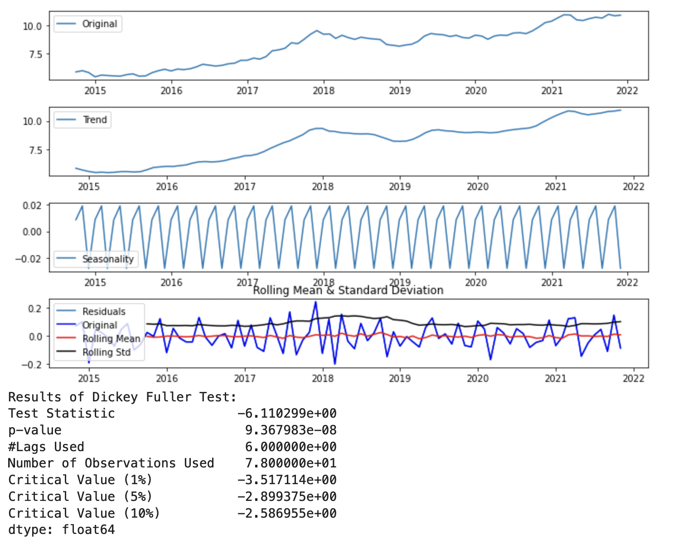

  

      <ul class="nav">
          <li><a href="{{ BASE_PATH }}/assets/qingzhu_cv.pdf">cv</a></li>
          <li><a href="https://github.com/QingZhu37">github</a></li>
          <li><a href="https://www.linkedin.com/in/qing-zhu-37b218212/">LinkedIn</a></li>
      </ul>
  

<figure></figure>
### Welcome!
##### Welcome, guests! I'm Qing Zhu. I'm a graduate student major in Data Analytics, MS at George Washington University.

### Portfolio

<table class="wide">
<tr>
  <td class="left">
    
  </td>
</tr>
</table>

