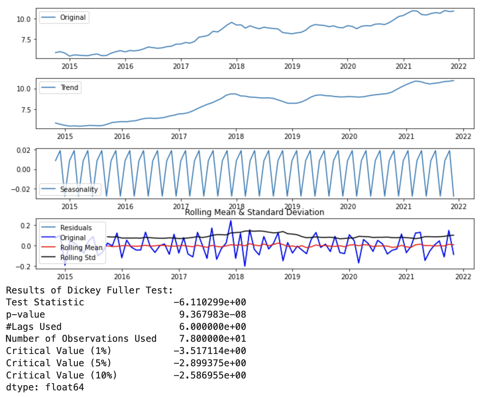

###  2021 Fall

#### SEAS 6401 Final Team Project: Analysit of USDX and ETFs
 
 
Slides:
Report:
github: &nbsp; &nbsp; &nbsp; 
 

  &nbsp; &nbsp; &nbsp;  

####  EMSE6574 Final Team Project: Cryptocurrency and S&P 500 Market Trends
 
 
Slides:
Report:
github: &nbsp; &nbsp; &nbsp; 
 

